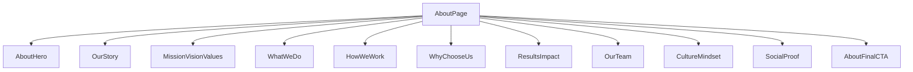

# About Page - Modular Component Structure

## Overview
The About page has been refactored into a clean, modular component structure for better maintainability, reusability, and code organization.

## Directory Structure

```
app/src/
├── app/about/
│   └── page.tsx                    # Main About page (orchestrator)
└── sections/about/
    ├── AboutHero.tsx               # Hero section with stats and CTA
    ├── OurStory.tsx                # Company origin story
    ├── MissionVisionValues.tsx     # Mission, vision, and core values
    ├── WhatWeDo.tsx                # Services overview with outcomes
    ├── HowWeWork.tsx               # 5-step process
    ├── WhyChooseUs.tsx             # Key differentiators
    ├── ResultsImpact.tsx           # Case studies and metrics
    ├── OurTeam.tsx                 # Team members and specialists
    ├── CultureMindset.tsx          # Company culture and values
    ├── SocialProof.tsx             # Testimonials and client logos
    └── AboutFinalCTA.tsx           # Final call-to-action
```

## Component Breakdown

### 1. **AboutHero** (2.6 KB)
- **Purpose**: First impression with compelling value proposition
- **Features**:
  - Gradient background (brand colors)
  - Main headline with brand positioning
  - 4 stats (campaigns, ROAS, industries, retention)
  - Primary CTA button
- **Animations**: Fade-in, scale, and staggered stats

### 2. **OurStory** (2.9 KB)
- **Purpose**: Build trust through founder narrative
- **Features**:
  - Two-column layout (text + visual)
  - Problem statement
  - Solution approach
  - Visual card with icon
- **Animations**: Slide-in from left/right

### 3. **MissionVisionValues** (4.0 KB)
- **Purpose**: Communicate company principles
- **Features**:
  - 3 main cards (Mission, Vision, Promise)
  - 4 core values in dedicated section
  - Icons for visual interest
- **Animations**: Staggered fade-in, hover glow effect

### 4. **WhatWeDo** (3.5 KB)
- **Purpose**: Showcase services with outcome focus
- **Features**:
  - 6 service cards
  - Business outcomes (not features)
  - Feature lists with checkmarks
- **Animations**: Grid animation, hover effects

### 5. **HowWeWork** (2.7 KB)
- **Purpose**: Explain the process/methodology
- **Features**:
  - 5-step workflow
  - Gradient background
  - Connected visual flow
- **Animations**: Step-by-step reveal

### 6. **WhyChooseUs** (3.3 KB)
- **Purpose**: Highlight competitive advantages
- **Features**:
  - 6 differentiators
  - Icon-based cards
  - Two-column responsive grid
- **Animations**: Alternating slide-in, icon scale on hover

### 7. **ResultsImpact** (3.4 KB)
- **Purpose**: Prove ROI with real metrics
- **Features**:
  - 3 case study highlights
  - Growth badges
  - CTA to view more
- **Animations**: Cards with glow effect, hover states

### 8. **OurTeam** (3.7 KB)
- **Purpose**: Humanize the brand
- **Features**:
  - 3 key team members
  - Emoji avatars
  - Specialist network callout
- **Animations**: Fade-in, avatar scale on hover

### 9. **CultureMindset** (3.0 KB)
- **Purpose**: Showcase company culture
- **Features**:
  - 6 culture values
  - Gradient background
  - Glass morphism cards
- **Animations**: Scale-in, hover brightness

### 10. **SocialProof** (3.1 KB)
- **Purpose**: Build credibility
- **Features**:
  - 8 client logo placeholders
  - 3 testimonials
  - Quote styling
- **Animations**: Grid fade-in, staggered testimonials

### 11. **AboutFinalCTA** (2.0 KB)
- **Purpose**: Drive action
- **Features**:
  - Dual CTAs (primary + secondary)
  - Reassuring copy
  - Gradient background
- **Animations**: Scale-in effect

## Main Page Structure

```tsx
// app/src/app/about/page.tsx
export default function AboutPage() {
  return (
    <main className="pt-20 overflow-hidden">
      <AboutHero />
      <OurStory />
      <MissionVisionValues />
      <WhatWeDo />
      <HowWeWork />
      <WhyChooseUs />
      <ResultsImpact />
      <OurTeam />
      <CultureMindset />
      <SocialProof />
      <AboutFinalCTA />
    </main>
  );
}
```

## Benefits of Modular Structure

### ✅ **Maintainability**
- Each section is isolated and easy to update
- Changes don't affect other sections
- Clear file organization

### ✅ **Reusability**
- Components can be reused in other pages
- Easy to extract for landing pages
- Consistent design patterns

### ✅ **Testability**
- Each component can be tested independently
- Easier to debug issues
- Clear component boundaries

### ✅ **Scalability**
- Easy to add new sections
- Remove sections without breaking page
- Reorganize order with simple imports

### ✅ **Team Collaboration**
- Different team members can work on different sections
- Reduced merge conflicts
- Clear ownership of components

## Component Guidelines

### All components follow these patterns:

1. **"use client"** directive for client-side interactivity
2. **Framer Motion** for animations
3. **Lucide React** icons for consistency
4. **Brand colors** (#5210F8, #C47DFD, #072C55)
5. **Responsive design** (mobile-first)
6. **Accessibility** (semantic HTML, ARIA when needed)

## Customization

### To modify a section:
1. Navigate to `/sections/about/[ComponentName].tsx`
2. Update the content/styling as needed
3. Save and hot-reload will update the page

### To reorder sections:
1. Open `/app/about/page.tsx`
2. Rearrange the component imports
3. Save and the page updates

### To add a new section:
1. Create `/sections/about/NewSection.tsx`
2. Follow the pattern of existing sections
3. Import and add to `page.tsx`

## Performance Considerations

- **Code splitting**: Each component is a separate module
- **Lazy loading**: Consider dynamic imports for below-fold sections
- **Animation performance**: Using CSS transforms for smooth 60fps
- **Bundle size**: Individual components are 2-4 KB each

## Future Improvements

- [ ] Add dynamic content from CMS/API
- [ ] Implement lazy loading for below-fold sections
- [ ] Add more interactive elements (hover videos, 3D graphics)
- [ ] Create Storybook documentation
- [ ] Add unit tests for each component
- [ ] Implement A/B testing variants

## Total Lines of Code

- **Before refactor**: 773 lines in single file
- **After refactor**: 
  - Main page: 28 lines
  - 11 components: ~35 KB total
  - Average component size: ~3 KB

## Component Dependencies



## Contact

For questions about this structure, refer to the InvisiEdge development team or check the conversation history where this refactor was implemented.

---

**Last Updated**: 2026-02-09
**Refactored By**: Antigravity AI Assistant
**Status**: ✅ Production Ready
